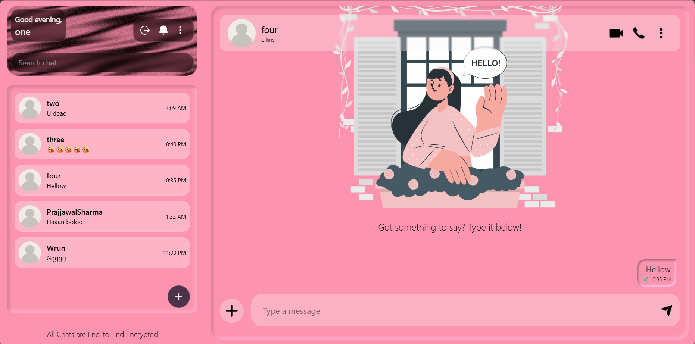
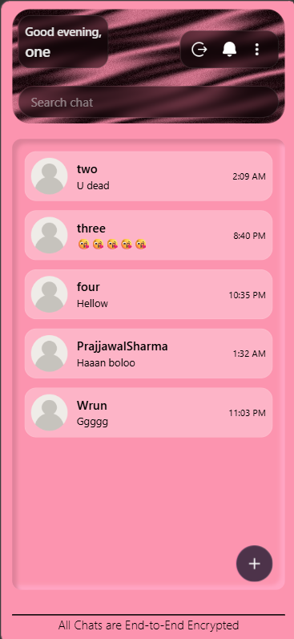

<h1 align="center">ORBI</h1>

<p align="center">
  <strong>A modern real-time messaging platform built with React, Node.js, Socket.IO, and MongoDB.</strong>
</p>

<p align="center">
  Privacy-focused • Real-time • Responsive • Secure
</p>

---

## 📖 About

ORBI is a full-stack real-time messaging application designed to provide fast, secure, and seamless communication.

Built with React, Tailwind CSS, Node.js, Express, Socket.IO, and MongoDB, ORBI focuses on delivering a modern chat experience with real-time messaging, conversation requests, notifications, and encrypted communication.

The platform is being developed with scalability, privacy, and reliability as core principles.

---

## 🖼️ Application Preview

### Desktop View



---

### Mobile Chat View


---

### Mobile Conversation List



---

## ✨ Current Features

### 🔐 Authentication
- Secure user registration and login
- JWT-based authentication
- Protected routes
- Protected Socket.IO connections

### 💬 Messaging
- One-to-one conversations
- Group conversations (In Progress)
- Real-time message delivery
- Message persistence
- Read receipts
- Typing indicators

### 🛡️ Privacy & Security
- Conversation request system
- User blocking
- Encrypted message storage
- Username-based discovery

### 🔔 Notifications
- Persistent notifications
- Real-time notification delivery
- Conversation request alerts

### 📱 Responsive Design
- Mobile-first experience
- Desktop support
- Progressive Web App (Planned)

---

## 🏗️ Tech Stack

### Frontend

- React
- React Router
- Tailwind CSS
- Socket.IO Client

### Backend

- Node.js
- Express.js
- Socket.IO

### Database

- MongoDB

### Authentication

- JWT
- bcrypt

---

## 📂 Frontend Structure

```text
src/
├── assets/
├── components/
├── hooks/
├── pages/
├── services/
├── sockets/
│   ├── socket.js
│   ├── chat.socket.js
│   ├── notification.socket.js
│   └── presence.socket.js
├── store/
├── utilities/
└── main.jsx
```

---

## ⚡ Real-Time Architecture

```text
User
 ↓
Socket.IO Client
 ↓
Socket.IO Server
 ↓
Conversation Room
 ↓
Message Delivery
 ↓
Database Persistence
```

---

## 🚀 Installation

Clone the repository:

```bash
git clone https://github.com/Raijin-Cyber/Suno.git
```

Install dependencies:

```bash
npm install
```

---

## ▶️ Running the Project

### Frontend

```bash
cd Frontend
npm run dev
```

### Backend

```bash
cd Backend
npm run dev
```

---

## 🛣️ Roadmap

### Version 1
- User authentication
- Real-time messaging
- Conversation requests
- Read receipts
- Typing indicators

### Version 2
- Group conversations
- Persistent notifications
- Media sharing
- Message reactions

### Version 3
- Progressive Web App
- Offline synchronization
- Retry mechanisms

### Version 4
- End-to-End Encryption
- Secure key backup
- Multi-device support

---

## 👨‍💻 Author

**Ujjwal Sharma**

- GitHub: https://github.com/Raijin-Cyber
- LinkedIn: https://www.linkedin.com/in/ujjwal-sharma-518039301
- Portfolio: https://ujjwalportfolio-lime.vercel.app
- X: https://x.com/raijinsigma

---

## ⭐ Support

If you like ORBI, consider giving it a star on GitHub.

It helps a lot and motivates future development.

---

## 📄 License

This project is licensed under the MIT License.